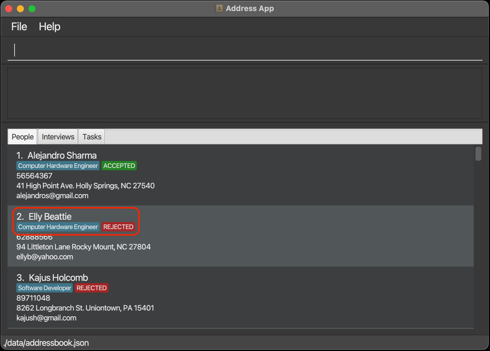
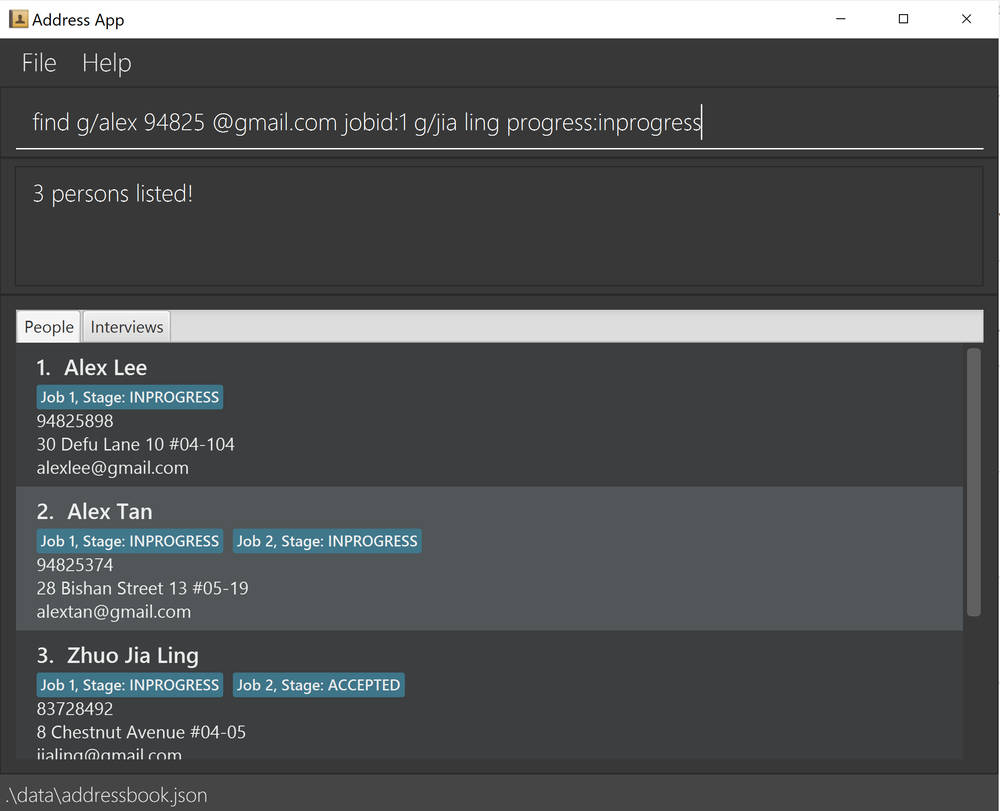

# HRConnect

HRConnect is a desktop application for managing the contacts of job applicants. It can also be used to keep track of 
the progress of each applicant during the application process.

* Table of Contents
  {:toc}

## Quick Start
1. Ensure you have `Java 11` or above installed in your computer.
2. Download the latest `HRConnect.jar` from <a href="https://github.com/AY2122S2-CS2103T-W11-2/tp">here</a>
3. Copy the file to the folder you want to use as the *home folder* for your HRConnect.
4. Double-click the file to start the app. The GUI similar to the below should appear in a few seconds. Note how the app contains some sample data.
   
  

5. Type your command into the command box and press `Enter` to execute it. 

    Some sample commands to try:
   * `add [p] n/Bob Tan p/98765876 e/bot@gmail.com a/262 Serangoon Central Drive 1-125 j/1 INPROGRESS`: Adds a new contact name Bob Tan to the address book
   * `list [p]`: Lists all contacts
   * `delete [p] Alex Lee`: Deletes job applicant named **Alex Lee** from the address book
   * `clear`: Deletes all contacts.
   * `exit`: Exits the app.

6. Refer to the [Features](#Features) below for details of each command.

## Features
### :information_source: Notes about the command format:
* Words in `UPPER_CASE` are the parameters to be supplied by the user. 
  
  e.g. in add n/NAME, NAME is a parameter which can be used as add n/John Doe.

* Items in square brackets are optional. 
  
  e.g n/NAME [j/APPLICATION] can be used as n/John Doe j/1 INPROGRESS or as n/John Doe.

* Items with ... after them can be used multiple times including zero times.

  e.g. [j/APPLICATION]... can be used as   (i.e. 0 times), j/1 INPROGRESS, j/2 ACCEPTED etc.

* Parameters can be in any order.
    
  e.g. if the command specifies n/NAME p/PHONE_NUMBER, p/PHONE_NUMBER n/NAME is also acceptable.

* If a parameter is expected only once in the command but you specified it multiple times, only the last occurrence of the parameter will be taken.

  e.g. if you specify p/12341234 p/56785678, only p/56785678 will be taken.

* Extraneous parameters for commands that do not take in parameters (such as help, list, exit and clear) will be ignored.

  e.g. if the command specifies `help 123`, it will be interpreted as `help`.

&nbsp;
### Viewing Help: `help`
Shows a message explaining how to access the help page and the basic commands.

Format: `help`  

&nbsp;
### Listing all job applicants/interviews: `list`
Shows a list of all job applicants/interviews in the address book.

Format: 
* `list [i]`: Show all interviews.
* `list [p]`: Show all job applicants.

&nbsp;
### Adding a new job applicant/interview: `add` 
Adds a new job applicant/interview to the address book.

* #### Adding a new job applicant 
  Format: `add [p] n/NAME p/PHONE_NUMBER e/EMAIL a/ADDRESS [j/APPLICATION]...`

  Example: `add [p] n/John Doe p/98765432 e/johnd@example.com a/311, Clementi Ave 2, #02-25 j/1 INPROGRESS`

* #### Adding a new interview 
  Format: `add [i] INDEX d/DATE t/TIME`

  Example: `add [i] 1 d/9-May-2020 t/17:30`

&nbsp;
### Editing a job applicant/interview: `edit`
Edits an existing job applicant/interview in the address book

* #### Editing a job applicant
  Format: `edit INDEX n/NAME j/APPLICATION`  
  Example: `edit 2 n/Amanda Tan j/3 REJECTED`   

Before edit command executed. 
   

After edit command is executed.  
   

* #### Editing interview details 
  {more to add}

&nbsp;
### Deleting job applicant/interview: `delete` 
Deletes an existing job applicant/interview timing in the address book.

* #### Deleting a job applicant 
  Format: `delete [p] INDEX` or `delete [p] NAME`

  Example: `delete [p] 1` or `delete [p] Alex Jones`

* #### Deleting an interview 
  Format: `delete [i] INDEX`

  Example: `delete [i] 1`

&nbsp;
### Finding a job applicant by keywords: `find` 
Finds job applicants whose data contain any of the given keywords.

Use `g/` flags to find job applicants whose data contain **all** the keywords.

:bulb: Hint: Use multiple `g/` flags to simulate an **OR** command (e.g. `find g/alex g/bukit g/stage:inprogress`)

Special Keywords:
* `jobdesc:`: Finds which job description the applicant has applied for.
* `stage:`: Finds which stage in the application process that the job applicant is at. (Only accepts: **inprogress**, **accepted**, **rejected**)

Format: `find g/KEYWORD [KEYWORDS...] [g/KEYWORD [KEYWORDS...]]...`

Examples:
* `find g/alex g/bukit g/111 g/@gmail` is logically equivalent to `find alex OR bukit OR 111 OR @gmail`
* `find g/alex bukit 111 @gmail` is logically equivalent to `find alex AND bukit AND 111 AND @gmail`
* `find g/alex bukit g/111 @gmail` is logically equivalent to `find (alex AND bukit) OR (111 AND @gmail)`

&nbsp;
### Clearing all entries: `clear` 
Clears all entries from the address book.  

Format: `clear`

&nbsp;
### Exiting the program: `exit` 
Exits the program.  

Format: `exit`

&nbsp;
## Storage
### Saving the data
AddressBook data are saved in the hard disk automatically after any command that changes the data. There is no need to save manually.

&nbsp;
### Editing the data file
AddressBook data are saved as a JSON file `[JAR file location]/data/addressbook.json`. Advanced users are welcome to update data directly by editing that data file.

:exclamation: **Caution:** If your changes to the data file makes its format invalid, the address book will discard all data and start with an empty data file at the next run.

&nbsp;
### Importing the data file: `import`

Imports all persons data from a *csv* or *json* save file generated from this address book.

File Format:
* CSV (tab delimited): name    phone_number    email_address    address    job_description    application_stage
* JSON: Follows the existing file data structure. 

Notes:
1. Filepath can be relative or absolute.
2. No duplicates are allowed to be imported into the address book.
   1. Data in the address book has a higher priority than data in the save file.
3. If any error is found, **none** of the data in the save file will be imported into the address book. 

Format: `import FILEPATH`

Example: `import C:\Users\<your username>\Desktop\data.csv` or `import ..\test\data.json`

&nbsp;
### Exporting to a csv data file: `export`

Exports all persons data from this address book to a *csv* save file.

File Format:
* File to export from: JSON (addressbook.json)
* File to export to: CSV (<YOUR_FILE_NAME.csv>)   

Notes:
1. Filepath of specified CSV file **must be absolute**.
2. File name of csv file cannot contain any front or back slash.
   1. Front slash: \
   2. Back slash: /
3. Specifying the same csv file name will overwrite the data inside the csv file.
4. Csv file must have .csv as a file extension.
5. Only the current data within the addressbook.json will be exported into the specified csv file.
6. Data exported into the specified CSV file will be seperated by tabs.
   1. (\t) represents a tab spacing between each field of data.
7. Each row of data inside the CSV file represents the details of 1 single person from the addressbook. 
   1. name(\t)phone_number(\t)email_address(\t)address(\t)job_description(\t)application_stage
8. If any error is found while executing the command, 
**none** of the data from the addressbook will be exported into the specified csv file.

Format: `export ABSOLUTE_FILEPATH_OF_CSV_FILE`

Example for WindowsOS: `export C:\Users\<YOUR_USERNAME>\Desktop\myData.csv`  
Example for MacOS: `export  /Users/<YOUR_USERNAME>/Downloads/myDataFile.csv 
`

## Command Summary

|               Action | Format                                                                       |
|---------------------:|:-----------------------------------------------------------------------------|
|        Add Interview | `add [i] 1 d/DATE t/TIME`                                                    |
|    Add Job Applicant | `add [p] n/NAME p/PHONE_NUMBER e/EMAIL a/ADDRESS [j/APPLICATION]...`         |
|                Clear | `clear`                                                                      |
|     Delete Interview | `delete [i] INDEX`                                                           |
| Delete Job Applicant | `delete [p] INDEX` `delete [p] NAME`                                     |
|                 Edit | `edit INDEX [n/NAME] [p/PHONE_NUMBER] [e/EMAIL] [a/ADDRESS] [j/APPLICATION]` |
|                 Exit | `exit`                                                                       |
|                 Find | `find g/KEYWORD [KEYWORDS...] [g/KEYWORD [KEYWORDS...]]...`                  |
|                 Help | `help`                                                                       |
|               Import | `import FILEPATH`                                                            |
|               Export | `export ABSOLUTE_FILEPATH_OF_CSV_FILE`                                       |
|      List Interviews | `list [i]`                                                                   |
|  List Job Applicants | `list [p]`                                                                   |
