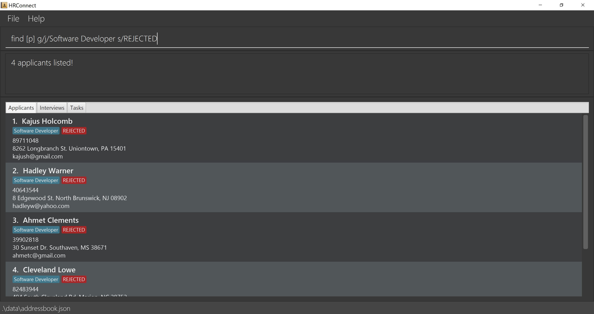
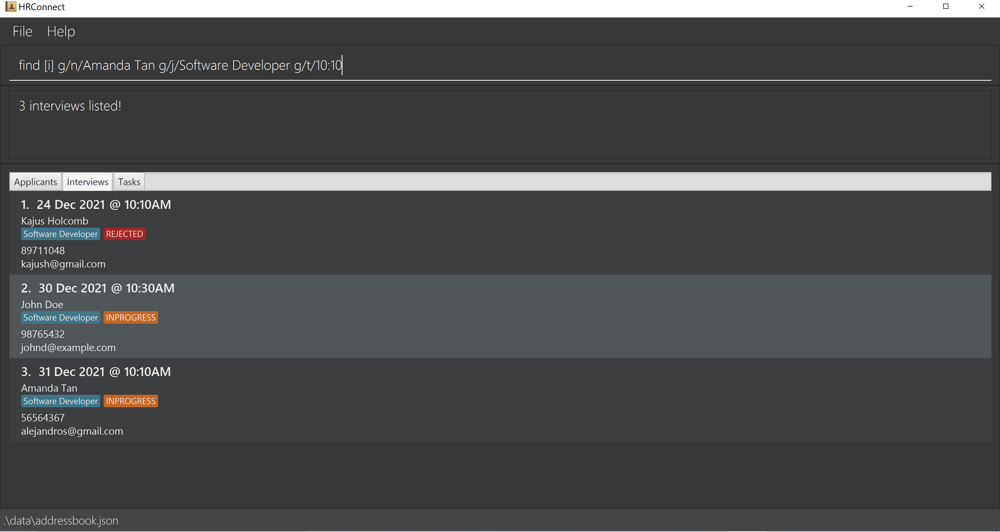
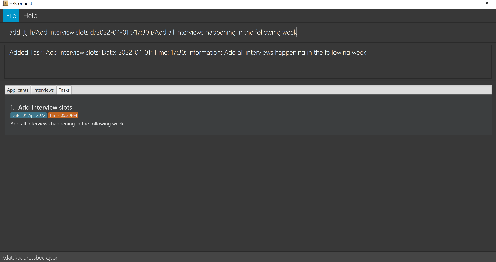
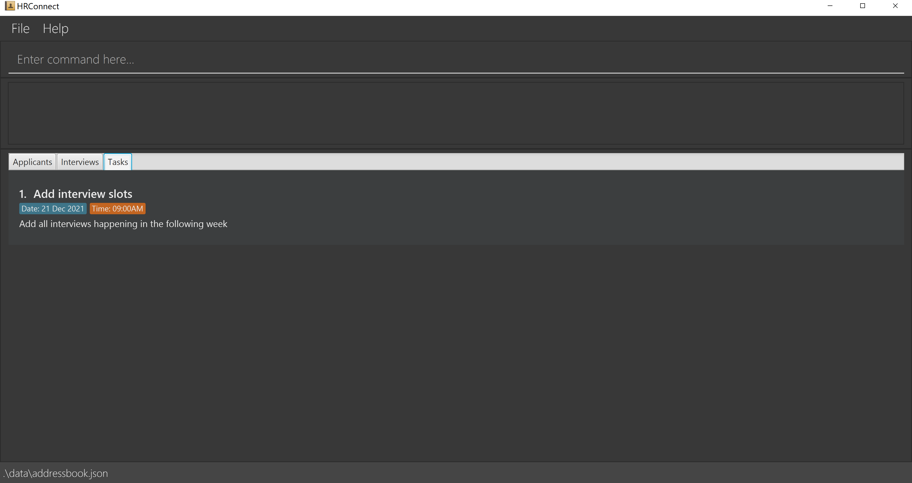
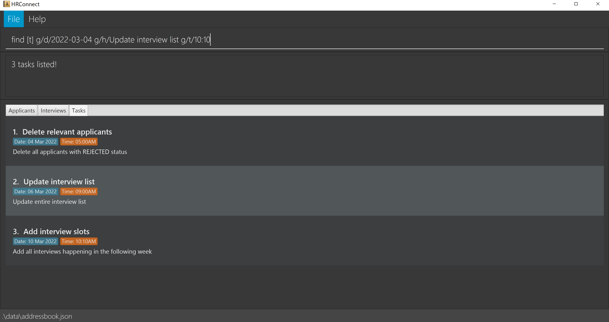

HRConnect is a desktop application for managing the contacts of job applicants. It can also be used to keep track of 
the progress of each applicant during the application process.

<h2>Table Of Contents</h2>
* Table of Contents
{:toc}

# Quick Start
1. Ensure you have `Java 11` or above installed in your computer.
2. Download the latest `HRConnect.jar` from <a href="https://github.com/AY2122S2-CS2103T-W11-2/tp/releases">here</a>
3. Copy the file to the folder you want to use as the *home folder* for your HRConnect.
4. Double-click the file to start the app. The GUI similar to the below should appear in a few seconds. Note how the app contains some sample data.
   
  

5. Type your command into the command box and press `Enter` to execute it. 

    Some sample commands to try:
   * `add [p] n/Bob Tan p/98765876 e/bot@gmail.com a/262 Serangoon Central Drive 1-125 
   j/Software Developer s/INPROGRESS`: Adds a new applicant name Bob Tan to the address book
   * `list [p]`: Lists all applicants
   * `delete [p] 1`: Deletes job applicant index **1** from the address book
   * `clear [p]`: Clear all applicants.
   * `exit`: Exits the app.

6. Refer to [Features](#features) section directly below for details on each command.

# Features

**:information_source: Notes about the command format regarding Features:** 

* Items in angle brackets are optional. 
  e.g n/NAME <p/PHONE_NUMBER> can be used as n/John Doe p/PHONE_NUMBER or as n/John Doe.

* Words in `UPPER_CASE` are the parameters to be supplied by the user. 
  e.g. in add n/NAME, NAME is a parameter which can be used as add n/John Doe.

* Items with ellipsis (...) after them can be used multiple times including zero times. 
  e.g. <a/ADDRESS>... can be used as   (i.e. 0 times), a/ADDRESS, a/ADDRESS etc.

* Parameters can be supplied in any order. 
  e.g. if the command requires n/NAME p/PHONE_NUMBER,   p/PHONE_NUMBER n/NAME is also acceptable.

* If a parameter is expected only once in the command but you specified it multiple times, only the last occurrence of the parameter will be taken. 
  e.g. if you specify p/12341234 p/56785678, only p/56785678 will be taken.

&nbsp;

## General Features
----------

**:information_source: Notes about the command format regarding General Features:** 

* Extraneous parameters for commands that do not take in parameters (such as help and exit) will be ignored. 
  e.g. if the command specifies `help 123`, it will be interpreted as `help`.

### Viewing Help: `help`
Shows a message explaining how to access the help page and the basic flags.

Format: `help`  

&nbsp;

### Exiting the program: `exit`
Exits the program.

Format: `exit`

## Applicant Features
----------

**:information_source: Notes about the Applicant List:** 

* Applicant list is sorted in order in which the applicant was added into the list. 
  e.g If Alex Tan was added before Alex Wong, Alex Tan would be listed above Alex Wong.

&nbsp;

### Adding a new job applicant: `add [p]`
Adds a new job applicant to the address book.

Format: `add [p] n/NAME p/PHONE_NUMBER e/EMAIL a/ADDRESS j/JOB_POSITION s/STAGE`

* Duplicate applicants cannot be added. Applicants are considered to be duplicates if they share the same name (case-insensitive).
e.g. `Alex Tan` and `alex tan` are duplicate applicants.
* If the `NAME` input contain empty spaces, it will be trimmed and each applicant will be considered as a duplicate even if their names differ in the amount of empty spaces.
e.g. `Alex Tan` and `Alex      Tan` are duplicate applicants.
e.g. `Alex Tan` and `AlexTan` are NOT duplicate applicants as `AlexTan` does not have any empty spaces. 
    
View constraints on flags and parameters [here](#flags-and-parameters-format-constraints)  

Example: 
`add [p] n/John Doe p/98765432 e/johnd@example.com a/311, Clementi Ave 2, #02-25 j/Software Developer s/INPROGRESS`

&nbsp;

### Editing a job applicant:`edit [p]`
Edits an existing job applicant in the address book

:exclamation: **Take note:** Cannot edit an applicant if he/she has an interview scheduled.

Format: `edit [p] INDEX <n/NAME> <p/PHONE_NUMBER> <e/EMAIL> <a/ADDRESS> <j/JOB_POSITION> <s/STAGE>`   

* At least one of the optional fields must be provided.  
* Edits the applicant at the specified `INDEX`. `INDEX` refers to the numerical position of the interview in the applicant list. The index must be a positive integer 1, 2, 3, …​

View constraints on flags and parameters [here](#flags-and-parameters-format-constraints)

Example: 
`edit [p] 2 n/Amanda Tan j/Software Developer s/INPROGRESS`   

Before

After

&nbsp;
### Deleting job applicant: `delete [p]` 
Deletes an existing job applicant from the address book.

:exclamation: **Take note:** Cannot delete an applicant if he/she has an interview scheduled.

Format: `delete [p] INDEX`

* Deletes the applicant at the specified `INDEX`. `INDEX` refers to the numerical position of the applicant in the applicant list.

Constraints:
* `INDEX` must be a positive integer 1, 2, 3, …​ and must be a valid task index.=

Example: 
`delete [p] 1`   

&nbsp;
### Listing all job applicants: `list [p]`
Shows a list of all job applicants in the address book.

Format:`list [p]`

&nbsp;
### Clearing all job applicants: `clear [p]`
Clears all job applicants from the address book.

:exclamation: **Take note:** Cannot clear applicant list if interview list is not empty.

Format: `clear [p]`

* Clear command does not throw an error even if applicant list is already empty and success message is shown.

&nbsp;
### Finding job applicant(s) by keywords: `find [p]` 
Finds job applicants whose data contain the given keywords.

Use `g/` flags to find job applicants whose data contain **all** the keywords.

:bulb: Tip: Use multiple `g/` flags as an **OR** command (e.g. `find [p] g/n/alex g/j/software developer g/s/INPROGRESS`)

Format: `find [p] g/KEYWORD <KEYWORDS>... <g/KEYWORD <KEYWORDS>...>...`

* Finding persons `[p]` **only** accepts `g/`, `n/`, `p/`, `e/`, `a/`, `j/`, and `s/` flags
* If a keyword without a flag is used, an error will be raised.
* Keywords are still required to follow the format defined as by the flags.

View constraints on flags and parameters [here](#flags-and-parameters-format-constraints)  

Examples: 
`find [p] g/s/ACCEPTED g/n/John Doe` is logically equivalent to  
`find [p] s/ACCEPTED OR n/John Doe`     
    

`find [p] g/j/Software Developer s/REJECTED` is logically equivalent to   
`find [p] j/Software Developer AND s/REJECTED`    

`find [p] g/j/Software Developer s/REJECTED g/n/John Doe` is logically equivalent to  
`find [p] (j/Software Developer AND s/REJECTED) OR n/John Doe`    

&nbsp;

## Interview Features
----------

**:information_source: Notes about the Interview List:** 

* Interview list is sorted in date time chronological order. 
  e.g An interview scheduled on 29 March 2020 is listed above an interview scheduled on 2 April 2020.
* Interview list can contain interviews with date and time past the current date and time.  
  e.g. If current date time is 4 April 2022, interview list can still contain interview with date 30 March 2022.

&nbsp;

&nbsp;
### Adding a new interview slot for a job applicant: `add [i]`
Adds a new job interview slot to the address book.

:exclamation: **Take note:** Only can add an interview for an applicant that is present in applicant list.

Format: `add [i] INDEX d/DATE t/TIME`   

* `INDEX` refers to the numerical position of the applicant in the applicant list. The index must be a positive integer 1, 2, 3, …​  
* Duplicate interviews cannot be added. Interviews are considered to be duplicates if they share the same date AND time.
e.g. `add [i] 1 d/2021-06-25 t/17:30` and `add [i] 2 d/2021-06-25 t/17:30` are adding duplicate interviews.

View constraints on flags and parameters [here](#flags-and-parameters-format-constraints)  

Example: 
`add [i] 1 d/2021-06-25 t/17:30`

&nbsp;
### Editing an existing interview slot: `edit [i]`
Edits an existing interview slot in the address book

Format: `edit [i] INDEX <d/DATE> <t/TIME>`   

* At least one of the optional fields must be provided.    
* Edits the interview at the specified `INDEX`. `INDEX` refers to the numerical position of the interview in the interview list. The index must be a positive integer 1, 2, 3, …​

View constraints on flags and parameters [here](#flags-and-parameters-format-constraints)

Examples:   
`edit [i] 1 d/2021-12-30 t/10:30`   

Before

After

&nbsp;
### Deleting an interview slot: `delete [i]`
Deletes an existing interview slot in the address book.

Format: `delete [i] INDEX`

* Deletes the interview at the specified `INDEX`. `INDEX` refers to the numerical position of the interview in the interview list. The index must be a positive integer 1, 2, 3, …​

Example: 
`delete [i] 1`

&nbsp;
### Listing all scheduled interviews: `list [i]`
Shows a list of all scheduled interviews in the address book.

Format: `list [i]`

&nbsp;
### Clearing all interviews: `clear [i]`
Clears all interviews from the address book.

Format: `clear [i]`

* Clear command does not throw an error even if interview list is already empty and success message is shown.

&nbsp;
### Finding scheduled interview slot(s) by keywords: `find [i]`
Finds interview slots with data containing any of the specified keywords.

Use `g/` flags to find interview slot(s) with data containing **all** the keywords.

:bulb: Hint: Use multiple `g/` flags to simulate an **OR** command (e.g. `find [i] g/n/alex g/j/software developer g/s/INPROGRESS`)

Format: `find [i] g/KEYWORD <KEYWORDS>... <g/KEYWORD <KEYWORDS>...>...`

* Finding interviews `[i]` **only** accepts `g/`, `n/`, `d/`, `t/`, and `j/`, flags.
* If a keyword without a flag is used, an error will be raised.
* Keywords are still required to follow the format defined as by the flags.

View constraints on flags and parameters [here](#flags-and-parameters-format-constraints)

Examples: 
`find [i] g/n/Amanda Tan g/j/Software Developer g/t/10:10` is logically equivalent to `find [i] n/Amanda Tan OR j/Software Developer OR t/10:10`   
    
`find [i] g/n/Amanda Tan j/Software Developer t/10:10` is logically equivalent to `find [i] n/Amanda Tan AND j/Software Developer AND t/10:10`   
    
`find [i] g/n/Amanda Tan j/Software Developer g/t/10:10` is logically equivalent to `find [i] (n/Amanda Tan AND g/j/Software Developer) OR t/10:10`   
    

## Task Features
----------

**:information_source: Notes about the Task List:** 

* Task list is sorted in date time chronological order. 
  e.g An task scheduled on 29 March 2020 is listed above a task scheduled on 2 April 2020.
* Task list can contain tasks with date and time past the current date and time.  
  e.g. If current date time is 4 April 2022, task list can still contain task with date 30 March 2022.

&nbsp;

### Adding a new task to the miscellaneous task list: `add [t]`
Adds a new task to the address book.

Format: `add [t] h/HEADER d/DATE t/TIME i/INFORMATION`   

* Duplicate tasks cannot be added. Tasks are considered to be duplicates if they share the same header AND date AND time.
e.g. `add [t] h/Update interview list d/2021-06-25 t/17:30 i/Update half of the interview list` and `add [t] h/Update interview list d/2021-06-25 t/17:30 i/Update the entire interview list` are adding duplicate interviews.
* If the `HEADER` input contain empty spaces, it will be trimmed and each header will be considered as a duplicate even if their header differ in the amount of empty spaces.
e.g. `Update interview list` and `Update         interview list` are duplicate headers.
e.g. `Update interview list` and `Updateinterviewlist` are NOT duplicate headers as `Updateinterviewlist` does not have any empty spaces.

View constraints on flags and parameters [here](#flags-and-parameters-format-constraints)

Example: 
`add [t] h/Add interview slots d/2022-04-01 t/17:30 i/Add all interviews happening in the following week`

&nbsp;
### Editing an existing task: `edit [t]`
Edits an existing task in the address book

Format: `edit [t] INDEX <h/HEADER> <d/DATE> <t/TIME> <i/INFORMATION>`  

* At least one of the optional fields must be provided.  
* Edits the task at the specified `INDEX`. `INDEX` refers to the numerical position of the task in the task list. The index must be a positive integer 1, 2, 3, …​

View constraints on flags and parameters [here](#flags-and-parameters-format-constraints)

Examples:  
`edit [t] 1 d/2021-12-30 t/10:30`   

Before

After

&nbsp;
### Deleting a task: `delete [t]`
Deletes an existing task in the address book.

Format: `delete [t] INDEX`

* Deletes the task at the specified `INDEX`. `INDEX` refers to the numerical position of the task in the task list. The index must be a positive integer 1, 2, 3, …​

Example: 
`delete [t] 1`

&nbsp;
### Listing all tasks: `list [t]`
Shows a list of all tasks in the address book.

Format: `list [t]`

&nbsp;
### Clearing all tasks: `clear [t]`
Clears all tasks from the address book.

Format: `clear [t]`

* Clear command does not throw an error even if task list is already empty and success message is shown.

&nbsp;
### Finding task(s) by keywords: `find [t]`
Find tasks with data containing any of the specified keywords.

Use `g/` flags to find task(s) with data containing **all** the keywords.

:bulb: Hint: Use multiple `g/` flags to simulate an **OR** command (e.g. `find [t] g/h/update t/10:10`)

Format: `find [t] g/KEYWORD <KEYWORDS>... <g/KEYWORD <KEYWORDS>...>...`

* Finding tasks `[t]` **only** accepts `g/`,`h/`, `d/`, `t/`, and `i/` flags
* If a keyword without a flag is used, an error will be raised.
* Keywords are still required to follow the format defined as by the flags.

View constraints on flags and parameters [here](#flags-and-parameters-format-constraints)

Examples: 
`find [t] g/d/2022-03-04 g/h/Update interview list g/t/10:10` is logically equivalent to `find [t] d/2022-03-04 OR h/Update interview list OR t/10:10`   

`find [t] g/d/2022-03-06 h/Update interview list t/09:00` is logically equivalent to `find [t] d/2022-03-06 AND h/Update interview list AND t/09:00`   

`find [t] g/d/2022-03-06 h/Update interview list g/t/10:10` is logically equivalent to `find [t] (d/2022-03-06 AND h/Update interview list) OR t/10:10`   

&nbsp;
## Storage
----------
### Saving the data
AddressBook data are saved in the hard disk automatically after any command that changes the data. There is no need to save manually.

&nbsp;
### Editing the data file
AddressBook data are saved as a JSON file `PATH_TO_JAR_FILE/data/addressbook.json`. Advanced users are welcome to update data directly by editing that data file.

:exclamation: **Caution:** If your changes to the data file makes its format invalid, the address book will discard all data and start with an empty data file at the next run.   
:exclamation: **Caution:** Inconsistent data resulting from manual modification of the data file should not be considered as unexpected behaviour.

&nbsp;
### Importing the data file: `import`

Imports all **job applicants** data from a *csv* save file generated from this address book.

File Format:
* CSV (tab delimited): name    phone_number    email_address    address    job_description    application_stage

Notes:
1. Filepath can be relative or absolute.
2. No duplicates are allowed to be imported into the address book.
   1. Data in the address book has a higher priority than data in the save file.
3. Save files needs to end with `.csv` in order for the address book to recognise the save file. 
4. If any error is found, **none** of the data in the save file will be imported into the address book.

Format: `import FILEPATH`

Example: 
`import C:\Users\YOUR_USERNAME\Desktop\data.csv`

&nbsp;
### Exporting to a csv data file: `export`

Exports all **job applicants** data from the address book into a *csv* save file.

File Format:
* CSV (tab delimited): name    phone_number    email_address    address    job_description    application_stage

Notes:
1. Filepath of specified CSV file can be relative or absolute.
2. File name of csv file **cannot** contain any front or backslashes.
   1. Invalid csv file name with front slash: myCSVfile\\.csv
   2. Invalid csv file name with backslash: myCSVfile/.csv
3. Specifying the same csv file name and path will overwrite the data inside the specified csv file.
4. Csv file **must** have .csv as a file extension. 
5. If any error is found while executing the command, 
**none** of the data from the addressbook will be exported into the specified csv file.

Format: `export FILEPATH`

Absolute filepath example for WindowsOS: `export C:\Users\YOUR_USERNAME\Desktop\myData.csv`  
Relative filepath example for WindowsOS: `export ./myData.csv`   
Absolute filepath example for MacOS: `export  /Users/YOUR_USERNAME/Downloads/myDataFile.csv`  
Relative filepath example for MacOS: `export  ./myDataFile.csv`

# Summary
## Flags and Parameters Format Constraints

| Flags | Parameters   | Format Constraints                                                                                                                                                                                                                                                                                                                                                                                                                                                                                                                                                                                                                                                                                  |
|------:|--------------|:----------------------------------------------------------------------------------------------------------------------------------------------------------------------------------------------------------------------------------------------------------------------------------------------------------------------------------------------------------------------------------------------------------------------------------------------------------------------------------------------------------------------------------------------------------------------------------------------------------------------------------------------------------------------------------------------------|
|    a/ | ADDRESS      | Addresses can take any values, and it should not be blank                                                                                                                                                                                                                                                                                                                                                                                                                                                                                                                                                                                                                                           |
|    d/ | DATE         | Date should be in the format YYYY-MM-dd                                                                                                                                                                                                                                                                                                                                                                                                                                                                                                                                                                                                                                                             |
|    e/ | EMAIL        | Emails should be of the format local-part@domain and adhere to the following constraints:   1. The local-part should only contain alphanumeric characters and these special characters, excluding the parentheses, (+_.-). The local-part may not start or end with any special characters.   2. This is followed by a '@' and then a domain name. The domain name is made up of domain labels separated by periods.   The domain name must:   - end with a domain label at least 2 characters long   - have each domain label start and end with alphanumeric characters   - have each domain label consist of alphanumeric characters, separated only by hyphens, if any. |
|    g/ |              | Compulsory (and used only in) `find` command. Used in combination with the other flags on this list                                                                                                                                                                                                                                                                                                                                                                                                                                                                                                                                                                                                 |
|    h/ | HEADER       | Header should only contain alphanumeric characters and spaces, and it should not be blank                                                                                                                                                                                                                                                                                                                                                                                                                                                                                                                                                                                                           |
|    i/ | INFORMATION  | Information should only contain alphanumeric characters and spaces, and it should not be blank                                                                                                                                                                                                                                                                                                                                                                                                                                                                                                                                                                                                      |
|    j/ | JOB_POSITION | Job should only contain alphanumeric characters and spaces, and it should not be blank                                                                                                                                                                                                                                                                                                                                                                                                                                                                                                                                                                                                              |
|    n/ | NAME         | Names should only contain alphanumeric characters and spaces, and it should not be blank                                                                                                                                                                                                                                                                                                                                                                                                                                                                                                                                                                                                            |
|    p/ | PHONE_NUMBER | Phone numbers should only contain numbers, and it should be at least 3 digits long                                                                                                                                                                                                                                                                                                                                                                                                                                                                                                                                                                                                                  |
|    s/ | STAGE        | Stage should be only INPROGRESS or ACCEPTED or REJECTED (case-sensitive)                                                                                                                                                                                                                                                                                                                                                                                                                                                                                                                                                                                                                            |
|    t/ | TIME         | Time should be in the format HH:MM                                                                                                                                                                                                                                                                                                                                                                                                                                                                                                                                                                                                                                                                  |

## List Types

| Type | Format                                            |
|-----:|:--------------------------------------------------|
|  [i] | Applies the current command to the interview list |
|  [p] | Applies the current command to the applicant list |
|  [t] | Applies the current command to the task list      |

## Command Summary

|               Action | Format                                                                                      |
|---------------------:|:--------------------------------------------------------------------------------------------|
|        Add Interview | `add [i] 1 d/DATE t/TIME`                                                                   |
|    Add Job Applicant | `add [p] n/NAME p/PHONE_NUMBER e/EMAIL a/ADDRESS j/JOB_POSITION s/STAGE`                    |
|             Add Task | `add [t] h/HEADER d/DATE t/TIME i/INFORMATION`                                              |
|     Clear Interviews | `clear [i]`                                                                                 |
| Clear Job Applicants | `clear [p]`                                                                                 |
|          Clear Tasks | `clear [t]`                                                                                 |
|     Delete Interview | `delete [i] INDEX`                                                                          |
| Delete Job Applicant | `delete [p] INDEX`                                                                          |
|          Delete Task | `delete [t] INDEX`                                                                          |
|       Edit Interview | `edit [i] INDEX <d/DATE> <t/TIME>`                                                          |
|   Edit Job Applicant | `edit [p] INDEX <n/NAME> <p/PHONE_NUMBER> <e/EMAIL> <a/ADDRESS> <j/JOB_POSITION> <s/STAGE>` |
|            Edit Task | `edit [t] INDEX <h/HEADER> <d/DATE> <t/TIME> <i/INFORMATION>`                               |
|                 Exit | `exit`                                                                                      |
|       Find Interview | `find [i] g/KEYWORD <KEYWORDS>... <g/KEYWORD <KEYWORDS>...>...`                             |
|   Find Job Applicant | `find [p] g/KEYWORD <KEYWORDS>... <g/KEYWORD <KEYWORDS>...>...`                             |
|            Find Task | `find [t] g/KEYWORD <KEYWORDS>... <g/KEYWORD <KEYWORDS>...>...`                             |
|                 Help | `help`                                                                                      |
|      List Interviews | `list [i]`                                                                                  |
|  List Job Applicants | `list [p]`                                                                                  |
|           List Tasks | `list [t]`                                                                                  |
|               Import | `import FILEPATH`                                                                           |
|               Export | `export FILEPATH`                                                                           |
|                 Help | `help`                                                                                      |
|                 Exit | `exit`                                                                                      |
